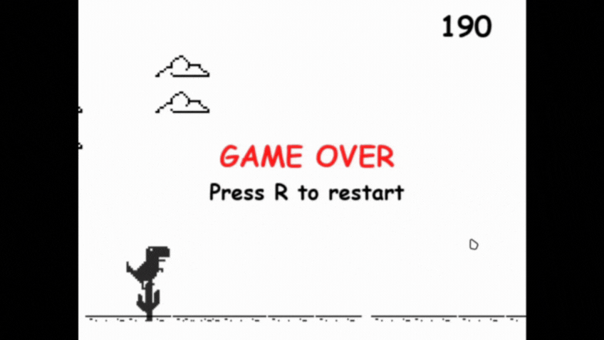

# 🦖 Dino Game

A **Chrome Dino-style** game developed in **Python**, with support for running both via script and as a compiled `.exe` for Windows.  
This project was created for learning and fun, using **Pygame** and custom graphic resources.

---

## 🚀 Technologies Used

- **Python 3.12+**
- **Pygame** (for graphics and game logic)
- **cx_Freeze** (to generate the `.exe`)
- **Spritesheets** for animations

---

## 📂 Project Structure

```
dino/
├── dino.py             # Main game script
├── images/             # Folder for game images
├── songs/                # Folder for game sounds
├── dist/               # Folder containing the compiled version
│   └── DinoGame.exe    # Windows executable
├── build/              # Temporary build files
└── DinoGame.spec       # PyInstaller configuration file
```

---

## 🕹️ How to Play

### 🔹 Running with Python

1. Make sure you have **Python 3.12+** installed.
2. Install dependencies:
   ```bash
   pip install pygame
   ```
3. Run the game:
   ```bash
   python dino.py
   ```

### 🔹 Running on Windows (compiled version)

1. Go to the folder:
   ```
   dist/
   ```
2. Double-click **`dino.exe`**.
3. Enjoy the game 🦖!

---

## 🎮 Controls

- **Spacebar** → Jump
- **Arrow Down** → Duck
- **ESC** → Exit the game

---

## 📸 Demo

GamePlay:



---

## 🛠️ Build the Executable

If you want to recreate the `.exe` yourself:

1. Install Dependencies:

First, ensure you have all the necessary packages for running and building the game. You can install them with pip:

```bash
pip install pygame pyinstaller
```

2. Run the Build Script:

Navigate to the project's root folder in your terminal and execute the build script:

```bash
python build.py
```

The script will automatically run PyInstaller with the correct configuration (bundling assets, hiding the console window, etc.).
The final DinoGame.exe file will be generated inside the dist/ folder.

---

## 👤 Author

- **Victor Miranda**
[](https://github.com/victor-kauan-coder)
[](https://www.linkedin.com/in/victor-miranda-5342a6337)
---
